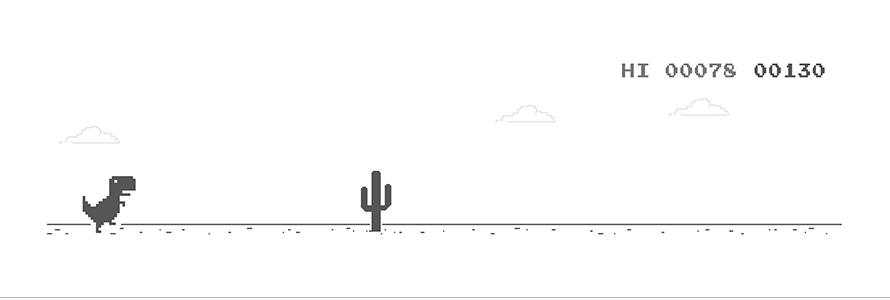

<style>
  :root {
    /* Color System - Matrix Theme */
    --color-primary: #00FF41;
    --color-secondary: #0D1117;
    --color-accent: #FF6F00;
    --color-text: #C9D1D9;
    --color-text-muted: #8B949E;
    --color-success: #00FF41;
    --color-warning: #FFD93D;
    --color-error: #FF4081;
    --color-info: #00E5FF;
    
    /* Typography */
    --font-display: 'JetBrains Mono', 'Fira Code', monospace;
    --font-body: 'Inter', -apple-system, BlinkMacSystemFont, 'Segoe UI', Roboto, sans-serif;
    --font-mono: 'JetBrains Mono', 'Fira Code', 'Cascadia Code', monospace;
    
    /* Spacing Scale */
    --space-xs: 4px;
    --space-sm: 8px;
    --space-md: 16px;
    --space-lg: 24px;
    --space-xl: 32px;
    --space-2xl: 48px;
    
    /* Border Radius */
    --radius-sm: 4px;
    --radius-md: 8px;
    --radius-lg: 12px;
    --radius-full: 9999px;
    
    /* Shadows */
    --shadow-sm: 0 1px 2px rgba(0, 0, 0, 0.3);
    --shadow-md: 0 4px 6px rgba(0, 0, 0, 0.4);
    --shadow-lg: 0 10px 15px rgba(0, 0, 0, 0.5);
    --shadow-glow: 0 0 20px rgba(0, 255, 65, 0.3);
    
    /* Transitions */
    --transition-fast: 150ms ease;
    --transition-normal: 300ms ease;
    --transition-slow: 500ms ease;
  }
  
  /* Global Styles */
  * {
    box-sizing: border-box;
  }
  
  body {
    font-family: var(--font-body);
    line-height: 1.6;
    color: var(--color-text);
    background: var(--color-secondary);
  }
  
  /* Animation Keyframes */
  @keyframes fadeIn {
    from { opacity: 0; transform: translateY(10px); }
    to { opacity: 1; transform: translateY(0); }
  }
  
  @keyframes slideInLeft {
    from { opacity: 0; transform: translateX(-20px); }
    to { opacity: 1; transform: translateX(0); }
  }
  
  @keyframes pulse {
    0%, 100% { opacity: 1; }
    50% { opacity: 0.7; }
  }
  
  @keyframes glow {
    0%, 100% { box-shadow: 0 0 5px var(--color-primary); }
    50% { box-shadow: 0 0 20px var(--color-primary), 0 0 30px var(--color-primary); }
  }
  
  @keyframes typewriter {
    from { width: 0; }
    to { width: 100%; }
  }
  
  /* Utility Classes */
  .fade-in {
    animation: fadeIn 0.6s ease-out forwards;
  }
  
  .slide-in-left {
    animation: slideInLeft 0.6s ease-out forwards;
  }
  
  .pulse {
    animation: pulse 2s infinite;
  }
  
  .glow {
    animation: glow 2s infinite;
  }
  
  /* Responsive Breakpoints */
  @media (max-width: 768px) {
    :root {
      --space-xl: 24px;
      --space-2xl: 32px;
    }
  }
  
  @media (max-width: 480px) {
    :root {
      --space-lg: 16px;
      --space-xl: 20px;
      --space-2xl: 24px;
    }
  }
  
  /* Hover Effects for Badges */
  img[src*="shields.io"] {
    transition: transform var(--transition-fast), box-shadow var(--transition-fast);
  }
  
  img[src*="shields.io"]:hover {
    transform: translateY(-2px);
    box-shadow: var(--shadow-glow);
  }
  
  /* Section Hover Effects */
  table {
    transition: transform var(--transition-normal);
  }
  
  table:hover {
    transform: translateY(-2px);
  }
  
  /* Link Hover Effects */
  a {
    transition: color var(--transition-fast), text-decoration-color var(--transition-fast);
  }
  
  a:hover {
    color: var(--color-primary) !important;
  }
  
  /* Stats Card Hover */
  .stats-card {
    transition: transform var(--transition-normal), box-shadow var(--transition-normal);
    border-radius: var(--radius-md);
    overflow: hidden;
  }
  
  .stats-card:hover {
    transform: translateY(-4px);
    box-shadow: var(--shadow-lg);
  }
  
  /* Responsive Images */
  img {
    max-width: 100%;
    height: auto;
  }
  
  /* Mobile-First Table Design */
  @media (max-width: 768px) {
    table {
      display: block;
      overflow-x: auto;
      white-space: nowrap;
    }
    
    td {
      display: inline-block;
      vertical-align: top;
      min-width: 200px;
    }
  }
  
  /* Typography Improvements */
  h1, h2, h3, h4, h5, h6 {
    font-family: var(--font-display);
    color: var(--color-primary);
    letter-spacing: 0.5px;
  }
  
  /* Code Block Styling */
  code {
    font-family: var(--font-mono);
    background: rgba(0, 255, 65, 0.1);
    padding: 2px 6px;
    border-radius: var(--radius-sm);
    color: var(--color-primary);
  }
  
  /* Blockquote Styling */
  blockquote {
    border-left: 4px solid var(--color-primary);
    padding-left: var(--space-md);
    margin: var(--space-md) 0;
    font-style: italic;
    color: var(--color-text-muted);
  }
</style>

<div align="center">


</div>

<a href="https://bit.ly/44BnGPo">
  <picture>
    <source media="(prefers-color-scheme: dark)" srcset="./dino-dark.gif" />
    <source media="(prefers-color-scheme: light)" srcset="./dino.gif" />
    
  </picture>
</a>

<div align="center">

[](https://github.com/JJ-Dynamite)

</div>

<br/>

<div align="center">

[](https://github.com/JJ-Dynamite?tab=followers)
[](https://github.com/JJ-Dynamite?tab=stars)
[](https://github.com/JJ-Dynamite)
[](https://github.com/JJ-Dynamite)
[](https://github.com/JJ-Dynamite)

</div>

<br/>

<div align="center">


</div>

<br/>

---

## 🎨 BRAND IDENTITY

<div align="center">


</div>

> **Design Philosophy**: A cohesive visual identity inspired by the Matrix aesthetic, combining technical precision with modern design principles. The color system uses green accents on dark backgrounds to create a high-contrast, developer-friendly experience.

**Color Palette:**
- **Primary**: `#00FF41` (Matrix Green) - Success, active states, primary actions
- **Secondary**: `#0D1117` (Dark Background) - Main background, depth
- **Accent**: `#FF6F00` (Orange) - Highlights, warnings, emphasis
- **Text**: `#C9D1D9` (Light Gray) - Primary text, readability
- **Info**: `#00E5FF` (Cyan) - Information, links, secondary actions

**Typography:**
- **Display**: JetBrains Mono - Headings, code, technical content
- **Body**: Inter - Paragraphs, descriptions, general text
- **Mono**: Fira Code - Code blocks, technical specifications

---

## 🧬 PROFILE MATRIX

<table>
<tr>
<td width="50%" valign="top">

### 👤 ABOUT ME
- **Name:** Joel J Mathew
- **GitHub:** JJ-Dynamite
- **Role:** Founder & CTO at Val-X
- **Location:** India
- **Experience:** 15+ Years
- **Projects:** 257+ Shipped

</td>
<td width="50%" valign="top">

### 🎯 WHAT I DO
- Building Startup Accelerators (8+ Ventures)
- Full-Stack Engineering (React, Rust, Node.js)
- AI Integration & Systems Architecture
- Web3 / Blockchain / dApp Development
- Technical Leadership & Product Strategy

</td>
</tr>
</table>

---

## 📖 THE STORY

> I'm Joel J Mathew, a self-taught computer scientist from India who has been coding since I was 12. I've spent the last 15 years building production-grade systems, shipping 257+ projects, and creating startup accelerators that have helped hundreds of founders launch their dreams.
>
> I believe in building fast, shipping faster, and scaling everything. My journey has been one of relentless curiosity, late-night debugging sessions, and an unshakeable belief that technology can solve humanity's biggest problems.
>
> I'm currently the Founder & CTO of **Val-X**, where I'm building the next generation of startup accelerators powered by AI. I'm also an author, music artist, and open-source contributor who believes in giving back to the community that has given me so much.
>
> When I'm not coding, you'll find me writing about psychology and influence, producing music, or exploring the intersection of technology and human behavior.


---

## ⚡ TECH MATRIX (200+ TOOLS)

### 🔧 PROGRAMMING LANGUAGES (40+)

<table>
<tr>
<td align="center"></td>
<td align="center"></td>
<td align="center"></td>
<td align="center"></td>
<td align="center"></td>
<td align="center"></td>
<td align="center"></td>
<td align="center"></td>
<td align="center"></td>
<td align="center"></td>
</tr>
<tr>
<td align="center"></td>
<td align="center"></td>
<td align="center"></td>
<td align="center"></td>
<td align="center"></td>
<td align="center"></td>
<td align="center"></td>
<td align="center"></td>
<td align="center"></td>
<td align="center"></td>
</tr>
<tr>
<td align="center"></td>
<td align="center"></td>
<td align="center"></td>
<td align="center"></td>
<td align="center"></td>
<td align="center"></td>
<td align="center"></td>
<td align="center"></td>
<td align="center"></td>
<td align="center"></td>
</tr>
<tr>
<td align="center"></td>
<td align="center"></td>
<td align="center"></td>
<td align="center"></td>
<td align="center"></td>
<td align="center"></td>
<td align="center"></td>
<td align="center"></td>
<td align="center"></td>
<td align="center"></td>
</tr>
</table>

### 🎨 FRONTEND FRAMEWORKS (30+)

<table>
<tr>
<td align="center"></td>
<td align="center"></td>
<td align="center"></td>
<td align="center"></td>
<td align="center"></td>
<td align="center"></td>
<td align="center"></td>
<td align="center"></td>
<td align="center"></td>
<td align="center"></td>
</tr>
<tr>
<td align="center"></td>
<td align="center"></td>
<td align="center"></td>
<td align="center"></td>
<td align="center"></td>
<td align="center"></td>
<td align="center"></td>
<td align="center"></td>
<td align="center"></td>
<td align="center"></td>
</tr>
<tr>
<td align="center"></td>
<td align="center"></td>
<td align="center"></td>
<td align="center"></td>
<td align="center"></td>
<td align="center"></td>
<td align="center"></td>
<td align="center"></td>
<td align="center"></td>
<td align="center"></td>
</tr>
</table>

### ⚙️ BACKEND FRAMEWORKS (25+)

<table>
<tr>
<td align="center"></td>
<td align="center"></td>
<td align="center"></td>
<td align="center"></td>
<td align="center"></td>
<td align="center"></td>
<td align="center"></td>
<td align="center"></td>
<td align="center"></td>
<td align="center"></td>
</tr>
<tr>
<td align="center"></td>
<td align="center"></td>
<td align="center"></td>
<td align="center"></td>
<td align="center"></td>
<td align="center"></td>
<td align="center"></td>
<td align="center"></td>
<td align="center"></td>
<td align="center"></td>
</tr>
<tr>
<td align="center"></td>
<td align="center"></td>
<td align="center"></td>
<td align="center"></td>
<td align="center"></td>
</tr>
</table>

### 🗄️ DATABASES & STORAGE (25+)

<table>
<tr>
<td align="center"></td>
<td align="center"></td>
<td align="center"></td>
<td align="center"></td>
<td align="center"></td>
<td align="center"></td>
<td align="center"></td>
<td align="center"></td>
<td align="center"></td>
<td align="center"></td>
</tr>
<tr>
<td align="center"></td>
<td align="center"></td>
<td align="center"></td>
<td align="center"></td>
<td align="center"></td>
<td align="center"></td>
<td align="center"></td>
<td align="center"></td>
<td align="center"></td>
<td align="center"></td>
</tr>
<tr>
<td align="center"></td>
<td align="center"></td>
<td align="center"></td>
<td align="center"></td>
<td align="center"></td>
</tr>
</table>

### ☁️ CLOUD & DEVOPS (30+)

<table>
<tr>
<td align="center"></td>
<td align="center"></td>
<td align="center"></td>
<td align="center"></td>
<td align="center"></td>
<td align="center"></td>
<td align="center"></td>
<td align="center"></td>
<td align="center"></td>
<td align="center"></td>
</tr>
<tr>
<td align="center"></td>
<td align="center"></td>
<td align="center"></td>
<td align="center"></td>
<td align="center"></td>
<td align="center"></td>
<td align="center"></td>
<td align="center"></td>
<td align="center"></td>
<td align="center"></td>
</tr>
<tr>
<td align="center"></td>
<td align="center"></td>
<td align="center"></td>
<td align="center"></td>
<td align="center"></td>
<td align="center"></td>
<td align="center"></td>
<td align="center"></td>
<td align="center"></td>
</tr>
<tr>
<td align="center"></td>
<td align="center"></td>
<td align="center"></td>
<td align="center"></td>
<td align="center"></td>
<td align="center"></td>
<td align="center"></td>
<td align="center"></td>
<td align="center"></td>
<td align="center"></td>
</tr>
</table>

### 🤖 AI & MACHINE LEARNING (30+)

<table>
<tr>
<td align="center"></td>
<td align="center"></td>
<td align="center"></td>
<td align="center"></td>
<td align="center"></td>
<td align="center"></td>
<td align="center"></td>
<td align="center"></td>
<td align="center"></td>
<td align="center"></td>
</tr>
<tr>
<td align="center"></td>
<td align="center"></td>
<td align="center"></td>
<td align="center"></td>
<td align="center"></td>
<td align="center"></td>
<td align="center"></td>
<td align="center"></td>
<td align="center"></td>
<td align="center"></td>
</tr>
<tr>
<td align="center"></td>
<td align="center"></td>
<td align="center"></td>
<td align="center"></td>
<td align="center"></td>
<td align="center"></td>
<td align="center"></td>
<td align="center"></td>
<td align="center"></td>
<td align="center"></td>
</tr>
<tr>
<td align="center"></td>
<td align="center"></td>
<td align="center"></td>
<td align="center"></td>
<td align="center"></td>
<td align="center"></td>
<td align="center"></td>
<td align="center"></td>
<td align="center"></td>
<td align="center"></td>
</tr>
</table>

### 🛠️ DEVELOPER TOOLS (30+)

<table>
<tr>
<td align="center"></td>
<td align="center"></td>
<td align="center"></td>
<td align="center"></td>
<td align="center"></td>
<td align="center"></td>
<td align="center"></td>
<td align="center"></td>
<td align="center"></td>
<td align="center"></td>
</tr>
<tr>
<td align="center"></td>
<td align="center"></td>
<td align="center"></td>
<td align="center"></td>
<td align="center"></td>
<td align="center"></td>
<td align="center"></td>
<td align="center"></td>
<td align="center"></td>
</tr>
<tr>
<td align="center"></td>
<td align="center"></td>
<td align="center"></td>
<td align="center"></td>
<td align="center"></td>
<td align="center"></td>
<td align="center"></td>
<td align="center"></td>
<td align="center"></td>
<td align="center"></td>
</tr>
<tr>
<td align="center"></td>
<td align="center"></td>
<td align="center"></td>
<td align="center"></td>
<td align="center"></td>
<td align="center"></td>
<td align="center"></td>
<td align="center"></td>
<td align="center"></td>
<td align="center"></td>
</tr>
</table>

### 📱 MOBILE & CROSS-PLATFORM (15+)

<table>
<tr>
<td align="center"></td>
<td align="center"></td>
<td align="center"></td>
<td align="center"></td>
<td align="center"></td>
<td align="center"></td>
<td align="center"></td>
<td align="center"></td>
<td align="center"></td>
<td align="center"></td>
</tr>
<tr>
<td align="center"></td>
<td align="center"></td>
<td align="center"></td>
<td align="center"></td>
<td align="center"></td>
</tr>
</table>

### 🧪 TESTING (15+)

<table>
<tr>
<td align="center"></td>
<td align="center"></td>
<td align="center"></td>
<td align="center"></td>
<td align="center"></td>
<td align="center"></td>
<td align="center"></td>
<td align="center"></td>
<td align="center"></td>
<td align="center"></td>
</tr>
<tr>
<td align="center"></td>
<td align="center"></td>
<td align="center"></td>
<td align="center"></td>
<td align="center"></td>
</tr>
</table>

### 🔐 SECURITY & AUTH (10+)

<table>
<tr>
<td align="center"></td>
<td align="center"></td>
<td align="center"></td>
<td align="center"></td>
<td align="center"></td>
<td align="center"></td>
<td align="center"></td>
<td align="center"></td>
<td align="center"></td>
<td align="center"></td>
</tr>
</table>

### 📊 MONITORING & OBSERVABILITY (10+)

<table>
<tr>
<td align="center"></td>
<td align="center"></td>
<td align="center"></td>
<td align="center"></td>
<td align="center"></td>
<td align="center"></td>
<td align="center"></td>
<td align="center"></td>
<td align="center"></td>
</tr>
</table>

---

## 🤖 AI SKILLS & TOOLS MATRIX

<table>
<tr>
<td align="center" width="33%">

### 🧠 AI MODELS & LLMs
<table>
<tr><td></td></tr>
<tr><td></td></tr>
<tr><td></td></tr>
<tr><td></td></tr>
<tr><td></td></tr>
</table>

</td>
<td align="center" width="33%">

### 🔬 AI FRAMEWORKS
<table>
<tr><td></td></tr>
<tr><td></td></tr>
<tr><td></td></tr>
<tr><td></td></tr>
<tr><td></td></tr>
</table>

</td>
<td align="center" width="33%">

### 🛠️ AI TOOLS & MLOPS
<table>
<tr><td></td></tr>
<tr><td></td></tr>
<tr><td></td></tr>
<tr><td></td></tr>
<tr><td></td></tr>
</table>

</td>
</tr>
</table>

---

## 📊 SKILL MATRIX

<table>
<tr>
<td width="50%" valign="top">

### 🎯 PRIMARY SKILLS
| Skill | Level | Projects | Status |
|-------|-------|----------|--------|
| TypeScript | ██████████ Expert | 50+ | ✅ Active |
| Rust (Axum) | █████████░ Advanced | 30+ | ✅ Active |
| React/Next.js | ██████████ Expert | 50+ | ✅ Active |
| Node.js | █████████░ Advanced | 40+ | ✅ Active |
| Python | ████████░░ Proficient | 25+ | ✅ Active |
| Docker/K8s | ████████░░ Proficient | 20+ | ✅ Active |
| PostgreSQL | ████████░░ Proficient | 35+ | ✅ Active |
| AWS/Azure | ███████░░░ Skilled | 15+ | ✅ Active |

</td>
<td width="50%" valign="top">

### 🤖 AI/SPECIALIZATION SKILLS
| Skill | Level | Projects | Status |
|-------|-------|----------|--------|
| LLM Integration | █████████░ Advanced | 15+ | 🚀 Growing |
| RAG Systems | ████████░░ Proficient | 10+ | 🚀 Growing |
| AI Agents | ████████░░ Proficient | 12+ | 🚀 Growing |
| Computer Vision | ███████░░░ Skilled | 8+ | 🚀 Growing |
| NLP/Text Processing | ████████░░ Proficient | 15+ | ✅ Active |
| AI Model Training | ███████░░░ Skilled | 5+ | 🚀 Growing |
| Prompt Engineering | █████████░ Advanced | 20+ | ✅ Active |
| MLOps | ███████░░░ Skilled | 8+ | 🚀 Growing |

</td>
</tr>
</table>

---

## 🚀 FAANG-GRADE PROJECTS

<table>
<tr>
<td align="center" width="25%">
<code>production-systems</code><br/>
<a href="https://github.com/JJ-Dynamite">

</a>
</td>
<td align="center" width="25%">
<code>tech-stack</code><br/>
<a href="https://github.com/JJ-Dynamite">

</a>
</td>
<td align="center" width="25%">
<code>ai-powered</code><br/>
<a href="https://github.com/JJ-Dynamite">

</a>
</td>
<td align="center" width="25%">
<code>open-source</code><br/>
<a href="https://github.com/JJ-Dynamite">

</a>
</td>
</tr>
</table>

---

## 🏗️ ARCHITECTURE OVERVIEW

<div align="center">


</div>

<table>
<tr>
<td align="center" width="33%">

### 🖥️ FRONTEND


</td>
<td align="center" width="33%">

### ⚙️ BACKEND


</td>
<td align="center" width="33%">

### 🤖 AI/ML


</td>
</tr>
<tr>
<td align="center" width="33%">

### ☁️ INFRA


</td>
<td align="center" width="33%">

### 🚀 DEVOPS


</td>
<td align="center" width="33%">

### 📊 MONITORING


</td>
</tr>
</table>

---

## 📊 CONTRIBUTION ACTIVITY

<div align="center">

### 📅 Contribution Heatmap


</div>

<table>
<tr>
<td align="center" width="33%">

### 📈 This Week


</td>
<td align="center" width="33%">

### 📊 This Month


</td>
<td align="center" width="33%">

### 📆 This Year


</td>
</tr>
</table>

---

## 📈 GITHUB ANALYTICS (2026 Tools)

<div align="center">

### 📊 Stats Dashboard


</div>

<table>
<tr>
<td align="center" width="33%">

### 📊 GitHub Stats


</td>
<td align="center" width="33%">

### 🔥 Streak Stats


</td>
<td align="center" width="33%">

### 🏆 Trophy Cabinet


</td>
</tr>
</table>

<div align="center">

### 📈 Activity Graph


### 🏆 Achievement System


### 🔥 Contribution Streak


### 🐍 Contribution Snake Animation


</div>

---

## 💡 WHAT I BRING TO THE TABLE

<table>
<tr>
<td align="center" width="25%">

### 🎯 PROBLEM SOLVING


</td>
<td align="center" width="25%">

### 🤖 AI-FIRST DEVELOPMENT


</td>
<td align="center" width="25%">

### 🏗️ ARCHITECTURE


</td>
<td align="center" width="25%">

### 🚀 SHIPMENT


</td>
</tr>
</table>

---

## 📚 AUTHOR

<div align="center">


</div>

> **The Psychology: The Hidden Machinery of Seduction, Manipulation, and Influence**
>
> A deep dive into the psychological mechanisms that drive human behavior. Drawing from neuroscience, evolutionary psychology, and real-world case studies, this book explores how we can understand and influence the people around us.

<div align="center">

[](https://www.amazon.com/dp/your-book-isbn)

</div>

---

## 🎵 MUSIC ARTIST

<div align="center">


</div>

<div align="center">

[](https://open.spotify.com/artist/your-spotify-id)
[](https://music.apple.com/artist/your-apple-music-id)
[](https://music.youtube.com/channel/your-youtube-music-id)
[](https://music.amazon.com/artist/your-amazon-music-id)
[](https://itunes.apple.com/artist/your-itunes-id)
[](https://pandora.com/artist/your-pandora-id)
[](https://tidal.com/browse/artist/your-tidal-id)
[](https://www.deezer.com/artist/your-deezer-id)

</div>

---

## 🚀 VENTURES

<div align="center">


</div>

<table>
<tr>
<td align="center" width="25%">

### 💼 Bonder Connect


</td>
<td align="center" width="25%">

### 🎯 Seductor


</td>
<td align="center" width="25%">

### 🏥 ValCure/NeoMediX


</td>
<td align="center" width="25%">

### 💕 DateClub


</td>
</tr>
<tr>
<td align="center" width="25%">

### 🏠 UStay


</td>
<td align="center" width="25%">

### 💳 ValenPay


</td>
<td align="center" width="25%">

### 🎬 Val-X Originals


</td>
<td align="center" width="25%">

### 🔒 Stealth Startup


</td>
</tr>
</table>

---

## 🌟 FEATURED PROJECTS

<table>
<tr>
<td align="center" width="33%">

### 🎯 Built With


</td>
<td align="center" width="33%">

### 🤖 AI Stack


</td>
<td align="center" width="33%">

### ☁️ Cloud Stack


</td>
</tr>
</table>

---

## 📬 CONNECT WITH ME

<div align="center">

[](https://www.linkedin.com/in/joel-j-mathew-71393a210/)
[](https://x.com/joeljmathew_)
[](https://www.instagram.com/joeljmathew_/)
[](https://www.facebook.com/joeljmathewOffical)
[](https://www.threads.net/@joeljmathew_)
[](https://www.youtube.com/@JoelJMathewOfficial)
[](https://open.spotify.com/artist/your-spotify-id)
[](https://joeljmathew.surge.sh)
[](mailto:joeljmathew@outlook.com)
[](https://github.com/JJ-Dynamite)

</div>

---

<div align="center">


```
⚡ JOEL J MATHEW | SELF-TAUGHT COMPUTER SCIENTIST | CTO | FOUNDER ⚡
```

</div>
